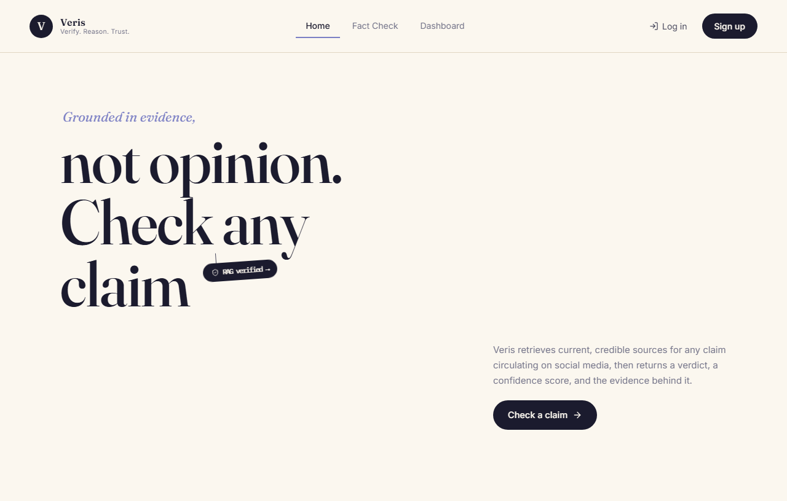
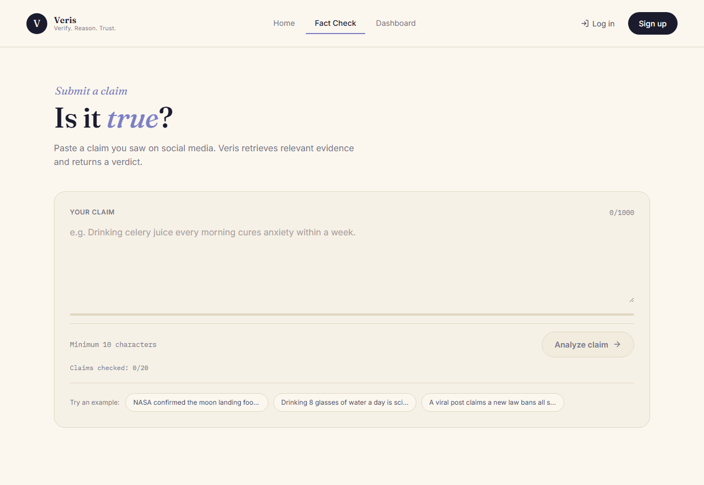
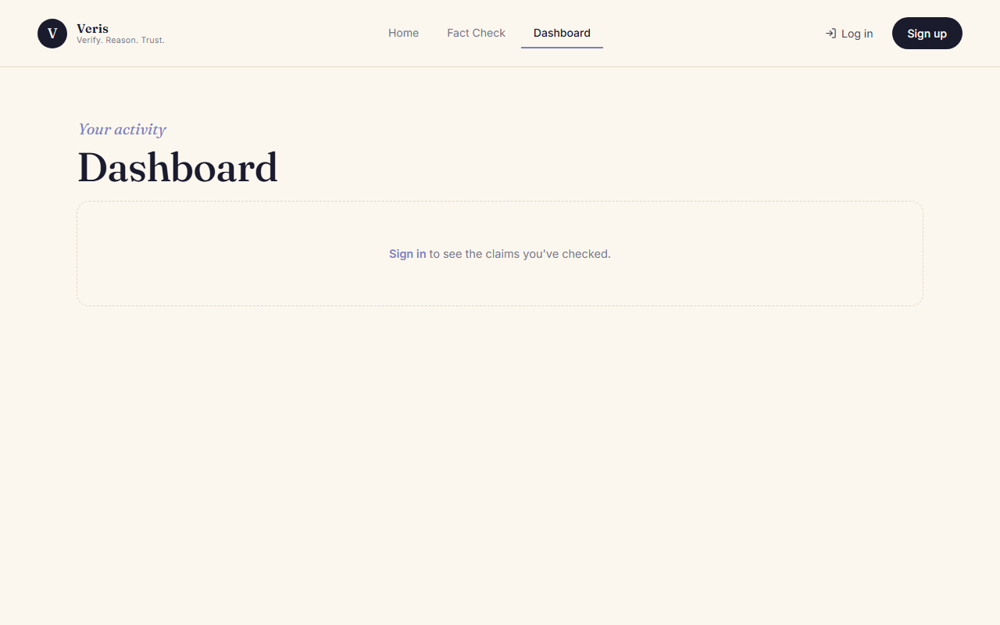
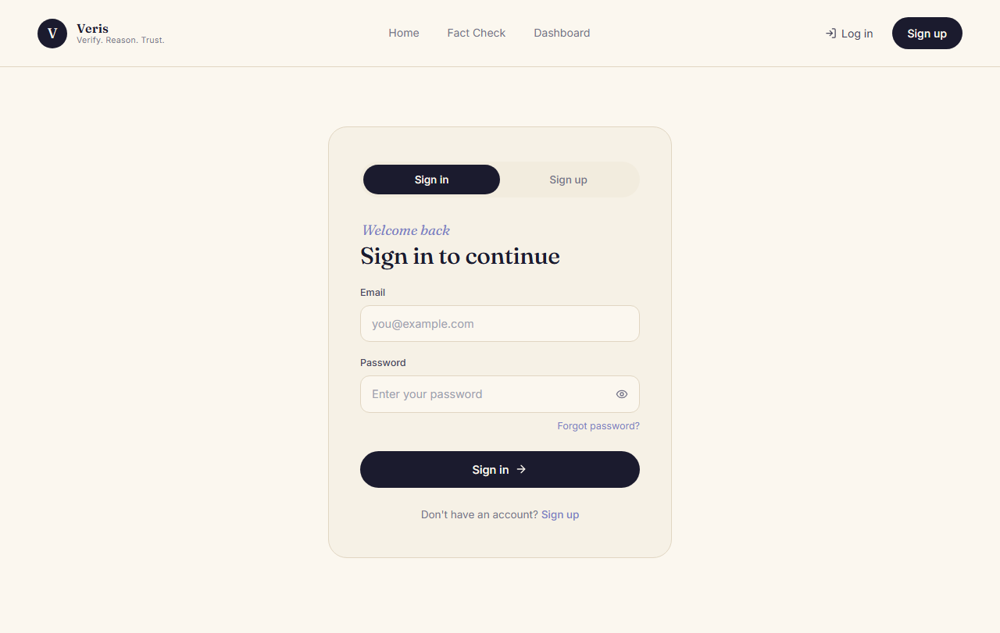
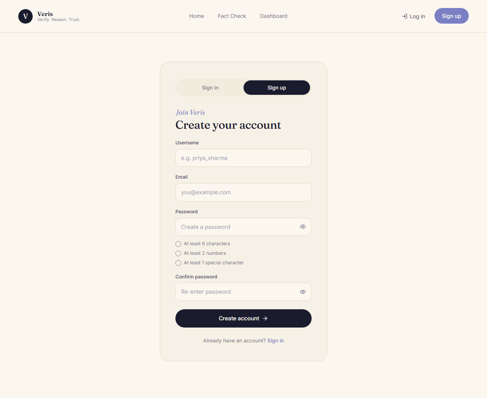
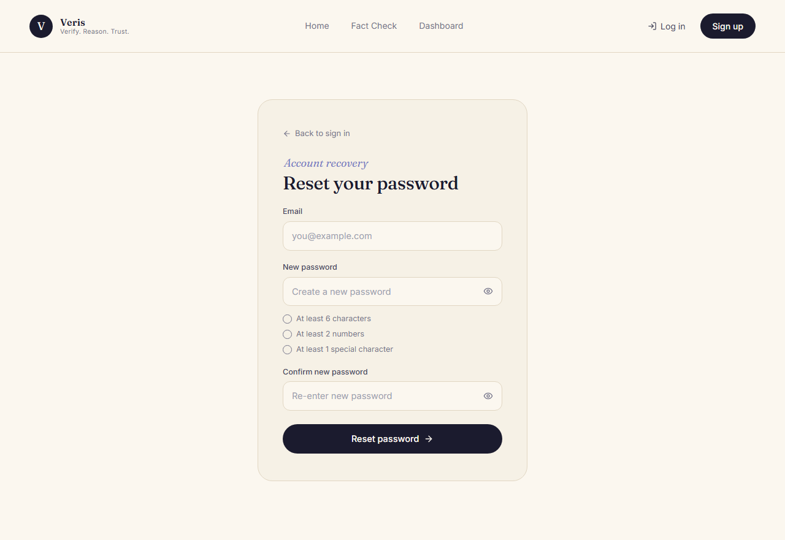

# Veris — Social Media Fact Checker with RAG

> **Verify. Reason. Trust.**  
> A production-grade RAG (Retrieval-Augmented Generation) application that fact-checks social media claims against a knowledge base of 484,848 verified fact-checks using semantic search, an LLM, and live web evidence.

---

## Table of Contents

- [Overview](#overview)
- [How It Works](#how-it-works)
- [Features](#features)
- [Tech Stack](#tech-stack)
- [Architecture](#architecture)
- [Project Structure](#project-structure)
- [Getting Started](#getting-started)
  - [Prerequisites](#prerequisites)
  - [Backend Setup](#backend-setup)
  - [Frontend Setup](#frontend-setup)
- [Environment Variables](#environment-variables)
- [API Endpoints](#api-endpoints)
- [Deployment](#deployment)
  - [Frontend → Vercel](#frontend--vercel)
  - [Backend → Render](#backend--render)
- [Limitations](#limitations)
- [Screenshots](#screenshots)
- [License](#license)

---

## Overview

Veris lets users paste any social media claim and receive an instant, evidence-backed verdict: **TRUE**, **FALSE**, **MISLEADING**, or **UNVERIFIED**. The system retrieves semantically similar fact-checks from a Pinecone vector index, falls back to live web search when no close match exists, and uses a Groq LLM to synthesize the final explanation with citations.

---

## How It Works

Veris checks a claim against a database of **484,848** previously fact-checked claims and, when nothing close is found, a live web search — then asks an AI model to weigh the evidence and explain its reasoning in plain language.

| Step | What happens |
|------|-------------|
| **1. Submit a claim** | You paste a statement you saw on social media. |
| **2. Embed it** | `multilingual-e5-large` turns it into a 1024-dimension vector. |
| **3. Retrieve evidence** | Pinecone finds the closest matches among 484,848 indexed claims. |
| **4. Reason** | If the match is weak, a live web search runs too, then Groq weighs it all. |
| **5. Return a verdict** | You get TRUE / FALSE / MISLEADING / UNVERIFIED, a confidence score, and sources. |

### 3-Tier Routing

| Tier | Condition | Evidence source |
|------|-----------|----------------|
| **HIGH** | Cosine similarity ≥ 0.88 | Index only — fast path |
| **MEDIUM** | Cosine similarity ≥ 0.86 | Index only |
| **LOW** | Cosine similarity < 0.86 | Live web search (Google Fact Check API + DuckDuckGo) |

---

## Features

- **Semantic fact-checking** — multilingual cosine similarity search over 484,848 pre-verified claims
- **3-tier routing** — fast index-only path for high-confidence matches; live web search only when needed
- **Live web evidence** — Google Fact Check Tools API + DuckDuckGo fallback with real publisher citations
- **LLM synthesis** — Groq Llama 3.3 70B writes the explanation, key points, and recommendation
- **Multilingual support** — the embedding model handles claims in 50+ languages (English, Hindi, Arabic, Tamil, Spanish, and more)
- **User accounts** — sign up / sign in / forgot password (no email link — admin-API based reset)
- **Dashboard** — personal check history with verdict and confidence breakdown
- **Responsive UI** — light/dark theme, mobile-first design

---

## Tech Stack

| Layer | Technology |
|-------|-----------|
| **Frontend** | React 18, Vite, Tailwind CSS, React Router v6 |
| **Auth & History** | Supabase (email/password auth, `checks` table with RLS) |
| **Backend** | Python 3.11, FastAPI, Uvicorn |
| **Embeddings** | `intfloat/multilingual-e5-large` (1024-dim) via HuggingFace Inference API |
| **Vector DB** | Pinecone (484,848 claim vectors, cosine metric) |
| **LLM** | Groq — `llama-3.3-70b-versatile` |
| **Web Search** | Google Fact Check Tools API + DuckDuckGo fallback |
| **HTTP client** | httpx |
| **Deployment** | Vercel (frontend) + Render (backend) |

---

## Architecture

```
User
 │
 ▼
React Frontend (Vite)
 │   Supabase Auth ─────────────── Supabase (session / user management)
 │   /api/* proxy (dev) or
 │   VITE_API_URL (prod)
 │
 ▼
FastAPI Backend
 │
 ├─ 1. Embed claim ──────────────► HuggingFace Inference API (multilingual-e5-large)
 │
 ├─ 2. Vector search ────────────► Pinecone (484,848 claim vectors)
 │         │
 │    similarity ≥ 0.88 (HIGH)   →  index evidence only  ─────────────────────┐
 │    similarity ≥ 0.86 (MEDIUM) →  index evidence only  ─────────────────────┤
 │    similarity < 0.86  (LOW)   →  live web search ──────────────────────────┤
 │         └── Google Fact Check API + DuckDuckGo                             │
 │                                                                              │
 └─ 3. LLM synthesis ────────────► Groq (llama-3.3-70b-versatile)  ◄───────────┘
          │
          ▼
     FactCheckResponse
     { verdict, confidence, explanation, key_points,
       recommendation, similar_claims, sources }
```

---

## Project Structure

```
.
├── backend/
│   ├── main.py                   # FastAPI app entrypoint
│   ├── config.py                 # Settings from env vars
│   ├── requirements.txt          # Production deps (API server only)
│   ├── requirements-pipeline.txt # Local-only deps (embeddings, pandas)
│   ├── .env.example              # Copy → .env and fill in keys
│   ├── models/
│   │   └── claim.py              # Pydantic schemas (ClaimRecord, FactCheckResponse …)
│   ├── routers/
│   │   ├── auth.py               # POST /api/reset-password (Supabase admin)
│   │   ├── claims.py             # GET /api/claims
│   │   ├── fact_check.py         # POST /api/fact-check
│   │   ├── health.py             # GET /health
│   │   ├── search.py             # GET /api/search
│   │   └── stats.py              # GET /api/stats
│   ├── services/
│   │   ├── embedding_service.py  # HF Inference API + local sentence-transformers fallback
│   │   ├── pinecone_service.py   # Pinecone index client
│   │   ├── groq_service.py       # Groq LLM client
│   │   ├── rag_pipeline.py       # 3-tier orchestrator
│   │   └── web_search_service.py # Google FC + DuckDuckGo
│   └── scripts/
│       ├── data_consolidation.py # Merge & clean raw datasets → claims_clean.csv
│       ├── generate_embeddings.py# Embed & upsert to Pinecone
│       └── sync_pinecone_to_csv.py
│
├── frontend/
│   ├── index.html
│   ├── vite.config.js            # Dev proxy: /api → :8000
│   ├── vercel.json               # SPA rewrite rule for Vercel
│   ├── tailwind.config.js
│   └── src/
│       ├── App.jsx
│       ├── pages/
│       │   ├── Auth.jsx          # Sign in / Sign up / Forgot password
│       │   ├── FactCheck.jsx     # Main claim submission UI
│       │   └── Dashboard.jsx     # History + statistics
│       ├── components/
│       │   ├── AuthCard.jsx
│       │   ├── FactCheckForm.jsx
│       │   ├── ResultCard.jsx
│       │   ├── EvidenceModal.jsx
│       │   ├── HistoryList.jsx
│       │   ├── LimitModal.jsx
│       │   ├── Hero.jsx
│       │   └── Navbar.jsx
│       ├── hooks/
│       │   ├── useAuth.jsx       # Supabase session + resetPassword
│       │   └── useClaimLimits.js # Freemium gate (20 anon / 1000 daily)
│       ├── services/
│       │   ├── api.js            # Axios client (factCheck, resetPassword …)
│       │   ├── history.js        # Supabase checks table (save / list / delete)
│       │   └── supabase.js       # Supabase client
│       └── utils/
│           └── verisVerdicts.js
│
├── docs/                         # App screenshots
├── render.yaml                   # Render deployment blueprint
└── .gitignore
```

---

## Getting Started

### Prerequisites

- Python 3.11+
- Node.js 18+
- A [Pinecone](https://www.pinecone.io/) account with an index named `fact-check-claims` (dimension 1024, cosine metric)
- A [Groq](https://console.groq.com/) API key
- A [HuggingFace](https://huggingface.co/settings/tokens) account for the Inference API token
- A [Supabase](https://supabase.com/) project (for auth + history)

### Backend Setup

```bash
cd backend
python -m venv .venv
# Windows
.venv\Scripts\activate
# macOS / Linux
source .venv/bin/activate

pip install -r requirements.txt

cp .env.example .env
# Edit .env and fill in your API keys (see Environment Variables below)

python -m uvicorn main:app --reload --port 8000
```

API is now live at `http://localhost:8000`. Interactive docs at `http://localhost:8000/docs`.

### Frontend Setup

```bash
cd frontend
npm install

cp .env.example .env
# Edit .env — add your VITE_SUPABASE_URL and VITE_SUPABASE_ANON_KEY

npm run dev
```

App is now live at `http://localhost:5173`.

---

## Environment Variables

### `backend/.env`

| Variable | Required | Description |
|----------|----------|-------------|
| `PINECONE_API_KEY` | Yes | Pinecone API key |
| `PINECONE_INDEX_NAME` | Yes | Index name (default: `fact-check-claims`) |
| `PINECONE_CLOUD` | Yes | Cloud provider (default: `aws`) |
| `PINECONE_REGION` | Yes | Region (default: `us-east-1`) |
| `PINECONE_NAMESPACE` | Yes | Namespace (default: `claims`) |
| `GROQ_API_KEY` | Yes | Groq API key for Llama 3.3 70B |
| `GROQ_MODEL` | No | Model ID (default: `llama-3.3-70b-versatile`) |
| `HF_API_TOKEN` | Yes (prod) | HuggingFace token for remote embeddings (avoids loading 2.3 GB model) |
| `SUPABASE_URL` | Yes | Your Supabase project URL |
| `SUPABASE_SERVICE_ROLE_KEY` | Yes | Service-role key — **never expose to frontend** |
| `GOOGLE_API_KEY` | No | Google Fact Check Tools API key (Tier 2 web search) |
| `ENABLE_WEB_SEARCH` | No | `true` / `false` (default: `true`) |
| `CORS_ORIGINS` | Yes (prod) | Comma-separated allowed origins, e.g. `https://your-app.vercel.app` |

### `frontend/.env`

| Variable | Required | Description |
|----------|----------|-------------|
| `VITE_SUPABASE_URL` | Yes | Supabase project URL |
| `VITE_SUPABASE_ANON_KEY` | Yes | Supabase anon/publishable key (safe for the browser) |
| `VITE_API_URL` | Prod only | Backend origin, e.g. `https://fact-checker-api.onrender.com` (empty in dev — Vite proxies `/api`) |

---

## API Endpoints

| Method | Path | Description |
|--------|------|-------------|
| `GET` | `/health` | Liveness check + dependency status |
| `POST` | `/api/fact-check` | Submit a claim → full RAG verdict |
| `GET` | `/api/stats` | Aggregate database statistics |
| `GET` | `/api/search` | Keyword search over the claims index |
| `GET` | `/api/claims` | Paginated list of indexed claims |
| `POST` | `/api/reset-password` | Admin password reset (no email link) |

Full interactive docs: `GET /docs`

### Example: Fact-check a claim

```bash
curl -X POST http://localhost:8000/api/fact-check \
  -H "Content-Type: application/json" \
  -d '{"claim": "Drinking hot water cures COVID-19"}'
```

```json
{
  "verdict": "FALSE",
  "confidence": 92,
  "explanation": "There is no scientific evidence that drinking hot water cures or prevents COVID-19 ...",
  "key_points": ["WHO has explicitly debunked this claim", "..."],
  "recommendation": "Follow official health guidance from WHO and local authorities.",
  "similar_claims": [...],
  "web_search_used": true,
  "sources": [{"publisher": "WHO", "title": "...", "url": "..."}]
}
```

---

## Deployment

### Frontend → Vercel

1. Import the GitHub repo in Vercel
2. Set **Root Directory** to `frontend`
3. Framework: **Vite** (auto-detected)
4. Add environment variables:
   - `VITE_SUPABASE_URL`
   - `VITE_SUPABASE_ANON_KEY`
   - `VITE_API_URL` → your Render backend URL
5. Deploy. The `vercel.json` SPA rewrite handles client-side routing automatically.

### Backend → Render

1. Connect the GitHub repo; Render auto-detects `render.yaml`
2. Add **secret** environment variables in the Render dashboard:
   - `PINECONE_API_KEY`
   - `GROQ_API_KEY`
   - `HF_API_TOKEN`
   - `SUPABASE_URL`
   - `SUPABASE_SERVICE_ROLE_KEY`
   - `CORS_ORIGINS` → your Vercel URL (must match exactly)
3. Use at least a **Standard** instance (512 MB minimum; the HF Inference API removes the local model load)

> **Cold-start note**: Render free-tier instances sleep after inactivity. The frontend uses a 180 s timeout on `/api/fact-check` to accommodate the wake-up delay.

---

## Limitations

- **Recent events** — a claim must be fact-checked and indexed before Veris can match it. Very new misinformation may not be in the database yet.
- **Image / video claims** — the system analyses text only. Claims that depend on visual content cannot be verified.
- **Not a final ruling** — a verdict here is a starting point, not an authoritative decision. When sources are listed, follow them and read what the fact-checker actually wrote.
- **Language coverage** — while `multilingual-e5-large` supports 50+ languages, the majority of indexed claims are in English. Non-English claims may get a lower-confidence match.

---

## Screenshots

### Home


### Fact Check


### Dashboard


### Sign In / Sign Up / Forgot Password
| Sign In | Sign Up | Forgot Password |
|---------|---------|-----------------|
|  |  |  |

---

## License

MIT © 2026 Dibendu Mondal
